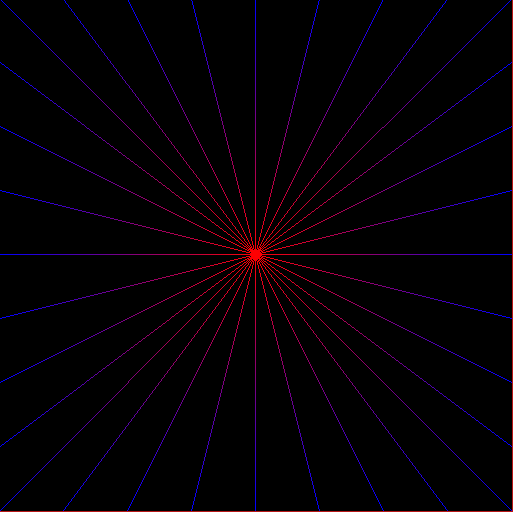
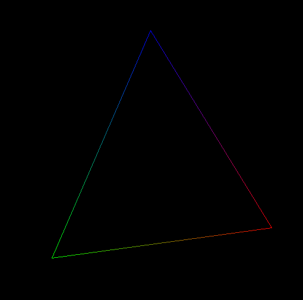
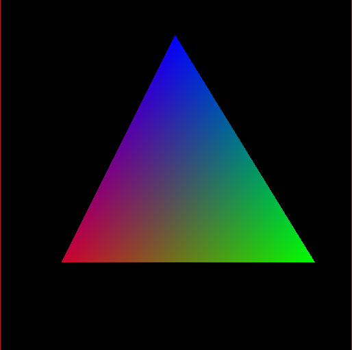
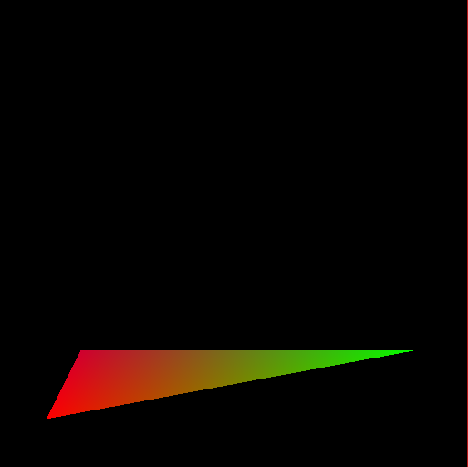

# Rasterizer
Um simples rasterizador de segmentos de reta e triângulos.

---
# Rasterização de segmento de retas (Algoritmo de Brasenham)

 Algoritmo adaptado para funcionar com os 8 octantes e com 
 interpolação linear das cores. Os 8 octantes foram feitos espelhando
 as coordenadas e trocando as coordenadas caso a inclinação da reta for maior
 que 45°.

---
# Triângulo

Triângulo construído apenas por segmentos de reta.

---
# Triângulo preenchido
Para fazer o preenchimento o triâgulo é divido em dois outros triângulos,
um com o primeiro vertice acima de dois outros vertices alinhados na vertical (bottom flat) e
outro com o ultimo vertice abaixo dos outros dois vertices, que também são alinhados na vertical (top flat).

## Bottom flat triangle

O bottom flat triangle é rasterizado com linhas horizontais (scan lines) começando do topo até alcançar os outros
dois vertices do triangulos, almentando de acordo com a inclinação de cada reta, assim criando um
bottom flat triangle.

## Top flat triangle

O top flat triangle é rasterizado da mesma forma que o bottom flat, mudando apenas os scan lines, que começam
da parte inferior e sobem até o topo.

## Junção dos dois triângulos

A implementação foi feita baseada em: http://www.sunshine2k.de/coding/java/TriangleRasterization/TriangleRasterization.html
